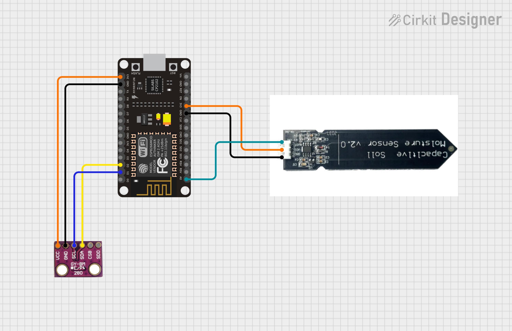

# ESP8266 Soil Moisture + BMP280 Monitor (Captive Portal)

This project turns an ESP8266 (e.g., NodeMCU/WeMos D1 mini) into a **Wi‑Fi access point** that serves a live dashboard (auto‑refresh every 5s) showing:
- **Soil moisture** (capacitive sensor on A0)
- **Temperature (°C)** and **Pressure (hPa)** from **BMP280** (I²C on D1/D2)

It also exposes a JSON endpoint at **`/data`**.



---

## 1) Hardware & Wiring

- **ESP8266**: NodeMCU/WeMos D1 mini (recommended)
- **Capacitive Soil Moisture Sensor**: 3.3V type
- **BMP280**: I²C module

**Connections**

| Module | Pin | ESP8266 |
|---|---|---|
| BMP280 | VCC | 3V3 |
| BMP280 | GND | GND |
| BMP280 | SCL | **D1** (GPIO5) |
| BMP280 | SDA | **D2** (GPIO4) |
| Soil Sensor | VCC | **3V3** (recommended) |
| Soil Sensor | GND | GND |
| Soil Sensor | OUT/Signal | **A0** |
| (Optional power gate) | Sensor VCC -> P‑MOSFET -> **D5** | if you want GPIO‑controlled power |

> **Note:** Most NodeMCU/WeMos boards already scale A0 to 3.3V. Bare ESP‑12E modules have a 1.0V A0 limit (use a resistor divider).

---

## 2) Arduino IDE Setup

1. **Boards**: Install *ESP8266 by ESP8266 Community* via **Boards Manager**.  
2. **Select board**: *NodeMCU 1.0 (ESP‑12E Module)* or *WeMos D1 mini*.  
3. **Libraries** (Library Manager):
   - `Adafruit BMP280 Library`
   - `Adafruit Unified Sensor` (dependency)
   - (Built‑in) `ESP8266WiFi`, `ESP8266WebServer`, `DNSServer`, `Wire`

---

## 3) Sketch Configuration

Open **`SoilBMP280_AP.ino`** and review:
- **SSID & Password** for the AP:
  ```cpp
  const char* ssid = "nex_1";
  const char* password = "";
  ```
- **BMP280 I²C address** (`0x76` default, some modules use `0x77`).
- **Soil calibration**:
  ```cpp
  #define DRY_VALUE 750
  #define WET_VALUE 300
  ```
  Measure your sensor’s raw values in dry and wet states and update these numbers.

---

## 4) Flash & Use

1. Connect the ESP8266 via USB and **Upload** the sketch.
2. On your phone/laptop, connect to the AP **`nex_1`**.
3. Open a browser to **`http://192.168.4.1/`**.  
   - Live dashboard updates every **5 seconds**.  
   - JSON: **`http://192.168.4.1/data`**

---

## 5) Troubleshooting

- **No BMP280 data**: Try address `0x77`. Check SCL/SDA (D1/D2), 3V3 and GND.
- **Moisture always 0%/100%**:
  - Power sensor from **3V3** (not from a GPIO), share **GND**.
  - Verify **A0** range on your board.
  - Re‑calibrate `DRY_VALUE` / `WET_VALUE`.
- **Page loads but values don’t change**:
  - Ensure the firmware is sampling (it reads every 5s).
  - JSON endpoint should show fresh numbers (no browser caching).

---

## 6) Files in this bundle

- `SoilBMP280_AP.ino` – firmware
- `README.md` – this guide
- `README.txt` – plain‑text version
- `circuit_diagram.png` – simple wiring diagram

---

**© REZLER SYSTEMS PRIVATE LTD** – Use at your own risk. Keep sensors dry as recommended by their datasheets.
